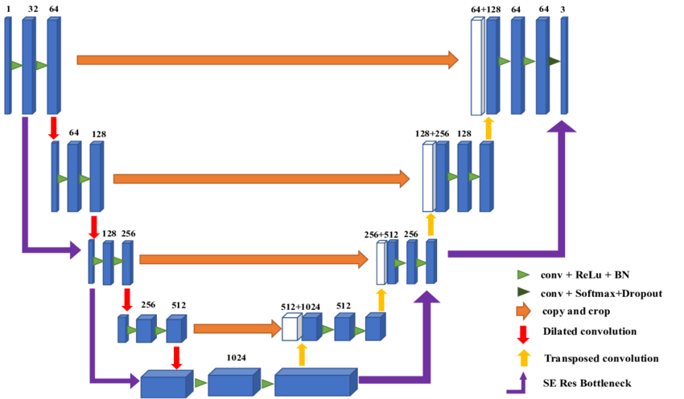
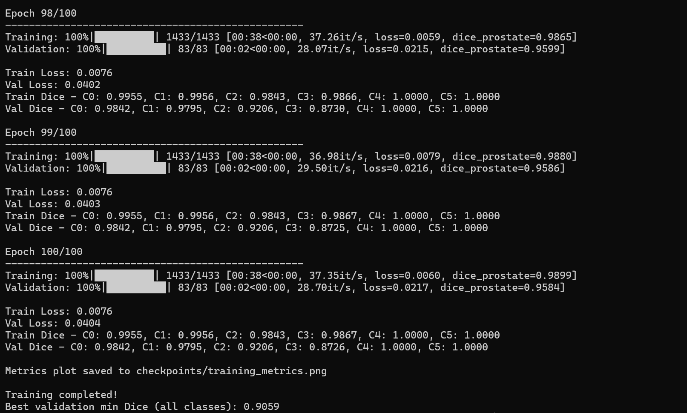
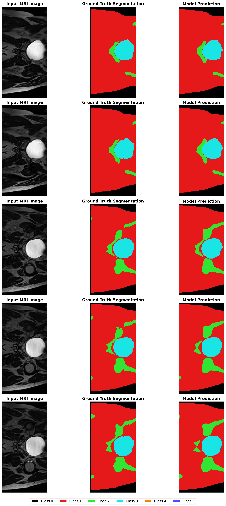

# 2D Improved UNet for Prostate MRI Segmentation

## Project Overview

This project implements a 2D Improved UNet architecture for multi-class semantic segmentation of 2D prostate MRI images from the HipMRI Study dataset. The model successfully segments 6 anatomical classes with high Dice coefficient score.

## Model Architecture

### Improved UNet Overview

The Improved UNet architecture is an enhanced version of the original U-Net, specifically optimized for medical image segmentation. Like the less improved version, this model still follows the encoder-decoder structure which is a network that follows a symmetric U-shape with a contracting path or downsamplilng (encoder) that captures context and an expansive path or upsampling (decoder) that enables precise localization. Skip connections are also utilised here at each resolution level, allowing the network to combine low-level spatial information with high-level semantic information. Now the improvements that were brought by this version of the model (also following the implementation in this particular case) are Instance Normalization instead of Batch Normalization for more stability especially for smaller batch sizes, Leaky ReLU Activation (alpha=0.01) instead of the traditional ReLU in order to prevent dying neurons and improves gradient flow, then context modules using double convolution blocks for better feature learning, and improved upsampling by using bilinear interpolation + convolution instead of transposed convolution.



*Figure 1: Improved UNet architecture. The encoder pathway (left) progressively reduces spatial dimensions while increasing feature channels. The decoder pathway (right) recovers spatial resolution through upsampling and skip connections. Each blue box represents feature maps, with dimensions shown above.*

### Network Specifications

| Component | Details |
|-----------|---------|
| **Input Size** | 1 × 256 × 128 (single-channel 2D MRI) |
| **Output Size** | 6 × 256 × 128 (6-class probability maps) |
| **Encoder Levels** | 4 (with max pooling) |
| **Decoder Levels** | 4 (with upsampling) |
| **Base Features** | 32 filters at highest resolution |
| **Feature Progression** | 32 → 64 → 128 → 256 → 512 |
| **Normalization** | Instance Normalization (affine=True) |
| **Activation** | Leaky ReLU (negative_slope=0.01) |
| **Output Activation** | None (raw logits for Dice Loss)  

### Architecture Details

**Encoder Path:**
```
Input (1, 256, 128)
  ↓ EncoderBlock1 (Conv3x3 + InstanceNorm + LeakyReLU) ×2
Skip1 (32, 256, 128) ────────────────────────────┐
  ↓ MaxPool 2×2                                   │
  ↓ EncoderBlock2 (64 filters)                    │
Skip2 (64, 128, 64) ──────────────────────┐      │
  ↓ MaxPool 2×2                            │      │
  ↓ EncoderBlock3 (128 filters)            │      │
Skip3 (128, 64, 32) ────────────┐         │      │
  ↓ MaxPool 2×2                  │         │      │
  ↓ EncoderBlock4 (256 filters)  │         │      │
Skip4 (256, 32, 16) ──┐         │         │      │
  ↓ MaxPool 2×2        │         │         │      │
Bottleneck (512, 16, 8)│         │         │      │
                       │         │         │      │
**Decoder Path:**      │         │         │      │
  ↓ Upsample + Conv    │         │         │      │
  ↓ Concat ←───────────┘         │         │      │
  ↓ DecoderBlock4 (256 filters)  │         │      │
  ↓ Upsample + Conv              │         │      │
  ↓ Concat ←─────────────────────┘         │      │
  ↓ DecoderBlock3 (128 filters)            │      │
  ↓ Upsample + Conv                        │      │
  ↓ Concat ←───────────────────────────────┘      │
  ↓ DecoderBlock2 (64 filters)                    │
  ↓ Upsample + Conv                               │
  ↓ Concat ←──────────────────────────────────────┘
  ↓ DecoderBlock1 (32 filters)
  ↓ Conv 1×1 (6 classes)
Output (6, 256, 128)
```

## Dataset

**HipMRI Study on Prostate Cancer**
- Training: 11,460 2D MRI slices
- Validation: 660 slices
- Test: 540 slices
- Classes: 6 anatomical structures (labels 0-5)
- Format: NIfTI (.nii.gz)
- Resolution: Primarily 256 × 128 pixels

### Data Preprocessing

1. **Normalization**: Z-score normalization per image
```python
   img_normalized = (img - img.mean()) / (img.std() + 1e-8)
```
2. **Resizing**: Images resized to 256 × 128 using bilinear interpolation
3. **Mask Processing**: Masks resized using nearest-neighbor interpolation to preserve discrete labels
4. **Label Validation**: All labels clipped to valid range [0, 5]

**Advantages of using Multi-class Dice Loss:**
- Each class contributes equally regardless of size
- Directly optimizes the evaluation metric (Dice coefficient)
- More robust to class imbalance than cross-entropy

### Training Progress



*Figure 2: Training and validation Dice scores across 100 epochs. Final validation minimum Dice reached 0.9059.*

### Qualitative Results



*Figure 3: Example segmentation results on test set. Left: Input MRI image, Middle: Ground truth segmentation, Right: Model prediction.*

### Class-Specific Outlier Observation

**Classes 4 & 5** (Dice = 1.0000):
- Perfect segmentation score but, likely small, well-defined structures with consistent appearance
- Present in only 35-40% of images, but always correctly identified or omitted

## Dependencies
```
python>=3.9
torch>=2.0
torchvision
nibabel
nilearn
scikit-image
numpy
matplotlib
tqdm
```

## Usage

### Training
```bash
# Activate environment
conda activate torch

# Run training
python train.py
```

Training outputs:
- Model checkpoints saved to `checkpoints/best_model.pth`
- Training metrics plot saved to `checkpoints/training_metrics.png`
- Console logs showing per-epoch Dice scores

### Inference
```bash
# Run prediction on test set
python predict.py
```

Outputs:
- Test set Dice scores printed to console
- Visualization saved to `test_predictions.png`

### Loading Trained Model
```python
import torch
from modules import ImprovedUNet

# Initialize model
model = ImprovedUNet(in_channels=1, num_classes=6, base_features=32)

# Load trained weights
checkpoint = torch.load('checkpoints/best_model.pth', weights_only=False)
model.load_state_dict(checkpoint['model_state_dict'])
model.eval()

# Inference
with torch.no_grad():
    output = model(input_image)
    prediction = torch.argmax(output, dim=1)
```

## Key Implementation Details

### Handling Variable Image Sizes

The dataset contains images with varying dimensions (majority at 256×128, minority at 256×144). Dynamic resizing is implemented in the data loader:
```python
target_size = (256, 128)
if img.shape[1:] != target_size:
    img = F.interpolate(img.unsqueeze(0), size=target_size, 
                       mode='bilinear', align_corners=False)
    mask = F.interpolate(mask.unsqueeze(0).unsqueeze(0).float(), 
                        size=target_size, mode='nearest')
```

### Multi-class Segmentation

All 6 anatomical classes (0-5) are preserved during training without label remapping, ensuring comprehensive segmentation of all structures present in the dataset.

## Author

Name: Gregorius Samuel Hutahaean (49072341)
Note: Student ID Github username under commits were because of pushing the commits to the remote repo from Rangpur cluster local repo.
